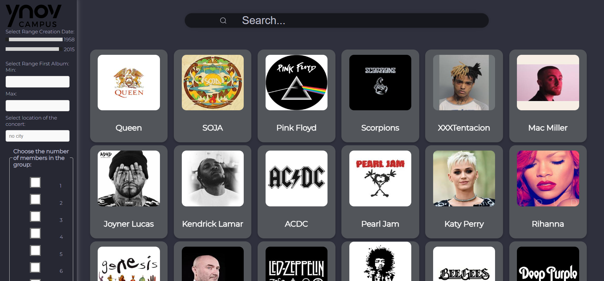
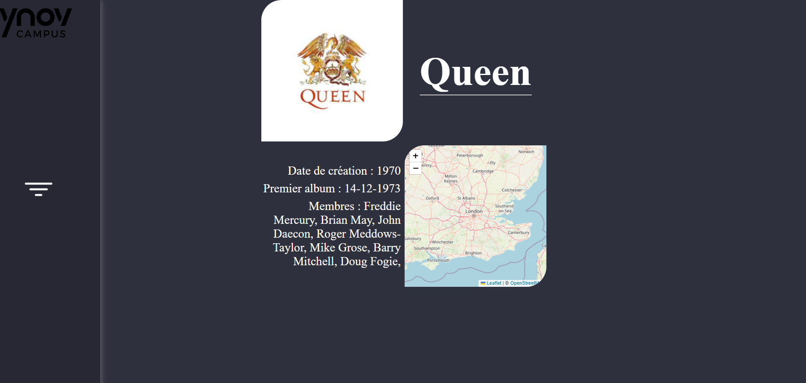

# Groupie Tracker

## Github :

Link : https://github.com/MelfStudent/Groupie-Tracker

## Objectives :

Groupie Tracker consists on using a given API and manipulating the data contained inside of it to create a website,displaying its information.

## Functionnalities :
You can find different informations about the artists you love: their name, the year of their debut, the date of their first published album, and even their members(if they are in a group).

You can also know the exact locations of their most recent concerts showed on a map (based on the data we got).

You can also filter the artists/groups by:
- The year of their debut;
- The date of their first published album;
- The number of members;
- The location of their concerts.

## Preview :

## Sources :

Html Part : https://developer.mozilla.org/fr/docs/Web/HTML/Element

Json Part : https://tutorialedge.net/golang/parsing-json-with-golang/

Concert geolocalisation API : https://www.openstreetmap.org/
